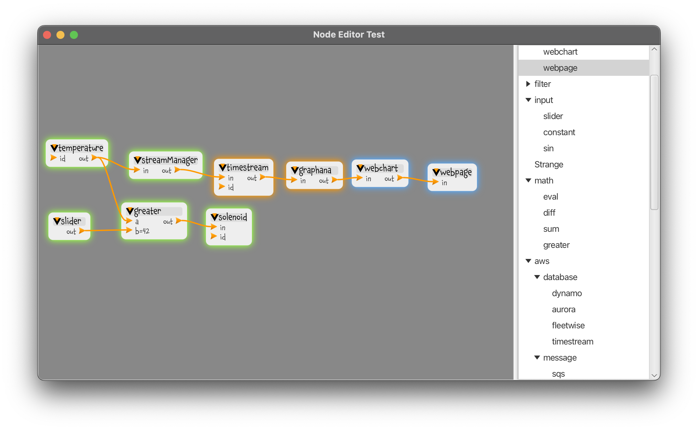

# Architecture Diagram Editor

	Copyright Amazon.com, Inc. or its affiliates. All Rights Reserved.
	SPDX-License-Identifier: Apache-2.0

This is a start on a tool for editing architecture diagrams, then using those
diagrams and some inferencing to generate and edit an implementation of that
diagram.  Think of it as a top-down IDE.

The structure of this project is rubbish.  It's all one repo.  It should be
broken up into multiple repos.

## Important Subparts (should be sub-repos)
### nodegraph
The architecture diagram.  Definitions of the nodes themselves,
the datatypes that flow across the arcs between them,
and the domains where the nodes can reside
(cloud, brower, gateway, edge device, ...)

### nodeviewerfx
The desktop UI

This is a [JavaFX](https://openjfx.io) component that implements a node editor,
in the spirit of the one found in
[Blender](https://docs.blender.org/manual/en/2.79/render/blender_render/materials/nodes/introduction.html).
It can be employed to edit all manner of node diagrams.

At least, eventually: right now it's a work in progress.

